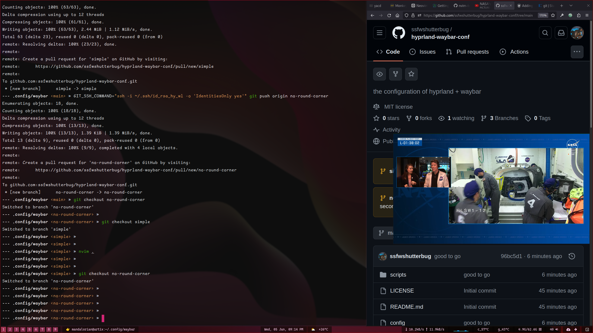

# hyprland-waybar-conf
the configuration of hyprland + waybar

Main branch is a clone of others, i changed to simple and no-round-corner branch and it works well so far.

- simple

- no-round-corner

